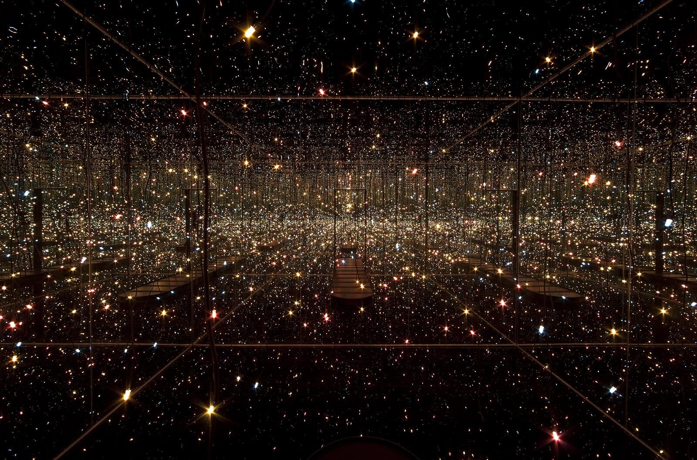
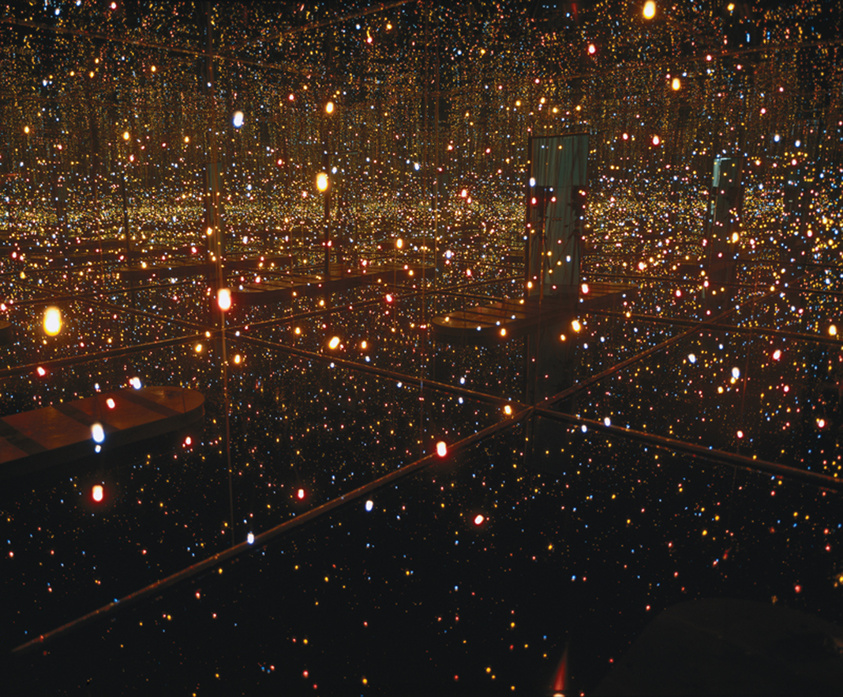
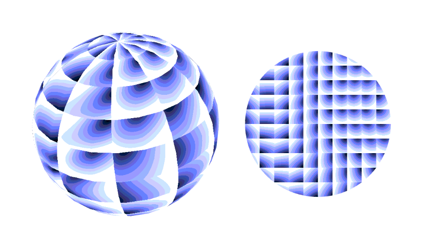

gcho0819_9103_tut05
## Week 8 Quiz
### Part 1
The art piece I’m drawing inspiration from is “Fireflies on the Water” by Yayoi Kusama. The imaging technique combines infinite mirror reflections, light, and spatial illusions to create a dreamlike environment with a sense of endlessness when the lights are outstretching. The aspect that I would like to incorporate in my project will be the reflection of water and mirrors that create an endless space. This is beneficial to our project in recreating the suggested artwork as this technique displays the method to create reflections from an uneven surface such as water and repetitions for the illusion of endless depth.

1. The artwork from Yayoi Kusama

2. An image of the water reflection

### Part 2
The coding technique that I could use in assisting in the implementation of the imaging technique discussed in part 1 is shader as a texture. This coding technique utilises different shades to represent the texture of the objects, hence various types of reflection can be created through the use of different shades. The use of shades creates wave distortion which can represent the reflection from uneven surfaces similar to the water surface in “Fireflies on the Water”.  Therefore, with shaders being available in pj5’s toolkit, it will aid in creating a wave-like distortion and realistic texture that I desire. 

1. A screenshot of the coding technique in action

2. [A link to an example implementation/code](https://p5js.org/examples/advanced-canvas-rendering-shader-as-a-texture/)
